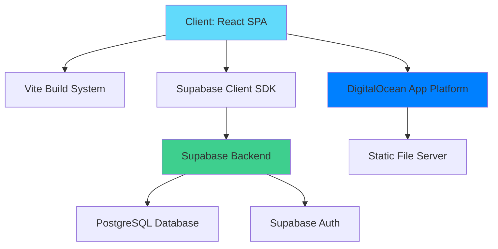

# Sistema Nota Fiscal

> Production-ready electronic invoice management system built with React, TypeScript, and Supabase

[](https://github.com/your-org/sistema-nota-fiscal/actions/workflows/ci.yml)
[](https://opensource.org/licenses/MIT)

## 📋 Table of Contents

- [Overview](#overview)
- [Architecture](#architecture)
- [Features](#features)
- [Prerequisites](#prerequisites)
- [Local Development](#local-development)
- [Environment Variables](#environment-variables)
- [Testing](#testing)
- [Deployment](#deployment)
- [Scripts](#scripts)
- [Contributing](#contributing)
- [License](#license)

## 🎯 Overview

Sistema Nota Fiscal is an internal tool for managing electronic invoices (NFes), providing features for:

- **Multi-shop management**: Manage invoices across multiple retail locations
- **Invoice tracking**: Track issue dates, payment status, accounting submission, and stock integration
- **Filtering & reporting**: Advanced filtering by shop, month, and status with real-time statistics
- **Responsive design**: Mobile-first UI built with Radix UI and Tailwind CSS

## 🏗 Architecture



### Tech Stack

| Layer | Technology | Purpose |
|-------|-----------|---------|
| **Frontend** | React 18 + TypeScript | UI framework with type safety |
| **Build Tool** | Vite | Fast dev server and optimized builds |
| **Styling** | Tailwind CSS | Utility-first CSS framework |
| **UI Components** | Radix UI + shadcn/ui | Accessible component primitives |
| **State Management** | TanStack Query | Server state & caching |
| **Form Handling** | React Hook Form + Zod | Type-safe form validation |
| **Backend** | Supabase | Postgres + Auth + Real-time |
| **Hosting** | DigitalOcean App Platform | Managed PaaS with auto-deploy |

## ✨ Features

- ✅ **NFe Management**: Create, read, update, delete electronic invoices
- ✅ **Shop Management**: Manage multiple retail locations with CNPJ validation
- ✅ **Advanced Filtering**: Filter by shop, month/year, payment status
- ✅ **Status Tracking**: Track accounting submission, stock integration, payment
- ✅ **Real-time Statistics**: Dashboard with total value, count, and status breakdown
- ✅ **Responsive Design**: Mobile-first UI with touch-friendly interactions
- ✅ **Type Safety**: End-to-end TypeScript with strict mode
- ✅ **Health Checks**: `/health` endpoint for monitoring

## 📦 Prerequisites

- **Node.js**: 24.2.x (see `.nvmrc`)
- **pnpm**: 10.x (install with `npm install -g pnpm`)
- **Supabase Project**: For backend services
- **Git**: For version control

## 🚀 Local Development

### 1. Clone and Install

```bash
# Clone the repository
git clone https://github.com/your-org/sistema-nota-fiscal.git
cd sistema-nota-fiscal

# Use correct Node version
nvm use

# Install dependencies
pnpm install
```

### 2. Configure Environment

```bash
# Copy example env file
cp .env.example .env

# Edit .env with your Supabase credentials
# Get these from your Supabase project settings
```

### 3. Start Development Server

```bash
pnpm dev
```

The app will be available at `http://localhost:8080`

### 4. Run Tests

```bash
# Unit tests
pnpm test

# E2E tests
pnpm test:e2e

# Coverage report
pnpm test:coverage
```

## 🔐 Environment Variables

All environment variables are **PUBLIC** and will be exposed in the browser bundle. **Never add private keys here.**

Create a `.env` file based on `.env.example`:

```bash
# Required
VITE_SUPABASE_URL=https://your-project.supabase.co
VITE_SUPABASE_PUBLISHABLE_KEY=your-anon-key-here
VITE_SUPABASE_PROJECT_ID=your-project-id
VITE_APP_ENV=production
VITE_APP_VERSION=1.0.0

# Optional
VITE_SENTRY_DSN=https://your-sentry-dsn
VITE_PLAUSIBLE_DOMAIN=yourdomain.com
```

### Environment Variable Validation

The app uses [Zod](https://zod.dev/) for runtime validation. If required variables are missing or invalid, the app will **fail fast** with a clear error message at startup.

See `src/lib/env.ts` for the validation schema.

## 🧪 Testing

### Unit Tests (Vitest)

```bash
# Run tests
pnpm test

# Watch mode
pnpm test:watch

# Coverage
pnpm test:coverage
```

**Coverage thresholds**: 80% (lines, functions, branches, statements)

### E2E Tests (Playwright)

```bash
# Run all browsers
pnpm test:e2e

# Run specific browser
pnpm exec playwright test --project=chromium

# Debug mode
pnpm exec playwright test --debug

# UI mode
pnpm exec playwright test --ui
```

### Testing Best Practices

- **Unit tests**: Test individual components and functions in isolation
- **Integration tests**: Test feature workflows (form submission, data fetching)
- **E2E tests**: Test critical user journeys (login, create NFe, filter)
- **Mock Supabase**: Use `vi.mock()` to mock Supabase client in unit tests

## 📦 Deployment

### Deploy to DigitalOcean App Platform (Recommended)

This project is configured for **single Web Service deployment** with auto-deploy from the `main` branch.

#### Step 1: Push to GitHub

Ensure your code is pushed to GitHub:

```bash
git push origin main
```

#### Step 2: Create App on DigitalOcean

1. Go to [DigitalOcean App Platform](https://cloud.digitalocean.com/apps)
2. Click **Create App**
3. Select **GitHub** as source
4. Authorize DigitalOcean to access your repository
5. Select your repository and `main` branch
6. Enable **Autodeploy on Push**

#### Step 3: Configure Build Settings

In the component configuration:

**Component Type:** Web Service

**Build Command:**
```bash
pnpm install --frozen-lockfile && pnpm build
```

**Run Command:**
```bash
npx serve -s dist -l $PORT
```

**Environment Variables:** Add the following from your `.env.example`:
- `VITE_SUPABASE_URL`
- `VITE_SUPABASE_PUBLISHABLE_KEY`
- `VITE_SUPABASE_PROJECT_ID`
- `VITE_APP_ENV=production`
- `VITE_APP_VERSION` (optional, auto-set by CI)
- `VITE_SENTRY_DSN` (optional)
- `VITE_PLAUSIBLE_DOMAIN` (optional)

**HTTP Port:** Uses `$PORT` environment variable (set automatically by DigitalOcean)

**Runtime Versions:**
- Node: **24.2.x** (pinned via `engines`, `.nvmrc`, `.node-version`)
- PNPM: **10.x** (via `packageManager` field)

> **Note:** DigitalOcean will automatically detect and use the pinned Node version from package.json engines field.

**Scaling:** Start with 1-2 instances, scale as needed

**Region:** Choose closest to your users (default: `nyc3`)

#### Step 4: Deploy

Click **Create Resources**. DigitalOcean will:
1. Pull your code from GitHub
2. Install dependencies with pnpm
3. Build the production bundle
4. Start the static file server
5. Provision a TLS certificate

**Initial deployment takes ~5-10 minutes.**

#### Step 5: Configure Custom Domain (Optional)

1. Go to your app's **Settings** → **Domains**
2. Add your custom domain (apex + www recommended)
3. Update DNS records as instructed
4. TLS certificate is automatically provisioned

### Auto-Deploy Workflow

Every push to `main` triggers:
1. ✅ GitHub Actions CI (lint, test, build, security audit)
2. ✅ DigitalOcean auto-deploy (build & deploy new version)

### Release Process

Releases are currently **manual** to support Node 24.2.0 on DigitalOcean:

1. Update version in `package.json`
2. Commit: `git commit -am "chore: bump version to x.x.x"`
3. Create tag: `git tag -a vx.x.x -m "Release x.x.x"`
4. Push: `git push origin main --tags`
5. Create release notes via [GitHub UI](https://github.com/your-org/sistema-nota-fiscal/releases/new)

> **Future:** To re-enable automated releases with semantic-release, upgrade DigitalOcean to Node ≥24.10.0.

### Health Check

After deployment, verify health:

```bash
curl https://your-app.ondigitalocean.app/health
```

Should return JSON with application status and version.

### Rollback

To rollback to a previous version:

1. **Via DigitalOcean UI**: Go to app → Deployments → Rollback
2. **Via Git**: Revert commit and push to `main`

```bash
git revert HEAD
git push origin main
```

## 📜 Scripts

| Command | Description |
|---------|-------------|
| `pnpm dev` | Start development server (port 8080) |
| `pnpm build` | Build for production |
| `pnpm preview` | Preview production build locally |
| `pnpm lint` | Run ESLint |
| `pnpm typecheck` | Run TypeScript type checking |
| `pnpm format` | Format code with Prettier |
| `pnpm format:check` | Check code formatting |
| `pnpm test` | Run unit tests |
| `pnpm test:watch` | Run tests in watch mode |
| `pnpm test:coverage` | Run tests with coverage |
| `pnpm test:e2e` | Run E2E tests |
| `pnpm test:ui` | Open Vitest UI |
| `pnpm analyze` | Analyze bundle size |

## 🔒 Security

### Security Best Practices

- ✅ All environment variables validated at startup
- ✅ No private keys in frontend code
- ✅ Dependency audits in CI pipeline
- ✅ Content Security Policy (CSP) ready
- ✅ HTTPS enforced by DigitalOcean
- ✅ Supabase Row Level Security (RLS) policies

### Security Headers

Configure these in your hosting environment (DigitalOcean App Platform handles most automatically):

```
X-Frame-Options: DENY
X-Content-Type-Options: nosniff
Referrer-Policy: strict-origin-when-cross-origin
```

### Reporting Security Issues

Please email security issues to: [security@yourdomain.com]

## 🤝 Contributing

We welcome contributions! Please see [CONTRIBUTING.md](CONTRIBUTING.md) for guidelines.

### Quick Start for Contributors

1. Fork the repository
2. Create a feature branch: `git checkout -b feat/amazing-feature`
3. Make your changes
4. Run tests: `pnpm test`
5. Commit with conventional commits: `git commit -m "feat: add amazing feature"`
6. Push to your fork: `git push origin feat/amazing-feature`
7. Open a Pull Request

### Commit Message Convention

We use [Conventional Commits](https://www.conventionalcommits.org/):

- `feat:` New feature
- `fix:` Bug fix
- `docs:` Documentation changes
- `style:` Code style changes (formatting, etc.)
- `refactor:` Code refactoring
- `test:` Test additions or updates
- `chore:` Maintenance tasks

## 📊 Monitoring & Observability

### Application Monitoring

- **Health Endpoint**: `/health` - Check application status
- **Version Info**: Available in health endpoint
- **Sentry** (optional): Error tracking and performance monitoring

### DigitalOcean Insights

DigitalOcean provides built-in monitoring:
- CPU, Memory, Bandwidth usage
- Request logs
- Build & deployment logs

Access via: App → Insights tab

## 🔧 Troubleshooting

### Build Failures

**Issue**: `pnpm install` fails
**Solution**: Ensure Node 24.2.0 is installed (`nvm use`)

**Issue**: TypeScript errors
**Solution**: Run `pnpm typecheck` to see detailed errors

### Runtime Issues

**Issue**: "Environment validation failed"
**Solution**: Check `.env` file has all required variables from `.env.example`

**Issue**: Supabase connection errors
**Solution**: Verify `VITE_SUPABASE_URL` and `VITE_SUPABASE_PUBLISHABLE_KEY` are correct

### Deployment Issues

**Issue**: DigitalOcean build fails
**Solution**: Check build logs in DigitalOcean dashboard for specific error

**Issue**: App shows blank page after deploy
**Solution**: 
1. Check browser console for errors
2. Verify environment variables are set in DigitalOcean
3. Test `/health` endpoint to verify app is running

**Issue**: SPA routing 404s
**Solution**: Ensure `serve` is configured with `-s` flag for SPA fallback

### Getting Help

- **Documentation**: Check this README and [CONTRIBUTING.md](CONTRIBUTING.md)
- **Issues**: [GitHub Issues](https://github.com/your-org/sistema-nota-fiscal/issues)
- **Discussions**: [GitHub Discussions](https://github.com/your-org/sistema-nota-fiscal/discussions)

## 📝 License

This project is licensed under the MIT License - see the [LICENSE](LICENSE) file for details.

## 🙏 Acknowledgments

- [Radix UI](https://www.radix-ui.com/) for accessible component primitives
- [shadcn/ui](https://ui.shadcn.com/) for beautiful component examples
- [Supabase](https://supabase.com/) for backend infrastructure
- [DigitalOcean](https://www.digitalocean.com/) for hosting platform

---

**Built with ❤️ using React, TypeScript, and Supabase**

---

## Project Info

**Repository**: https://github.com/your-org/sistema-nota-fiscal  
**Lovable Project**: https://lovable.dev/projects/df0648c2-9e00-47dc-b02b-4aeb4b44f95a  
**Documentation**: https://docs.lovable.dev
